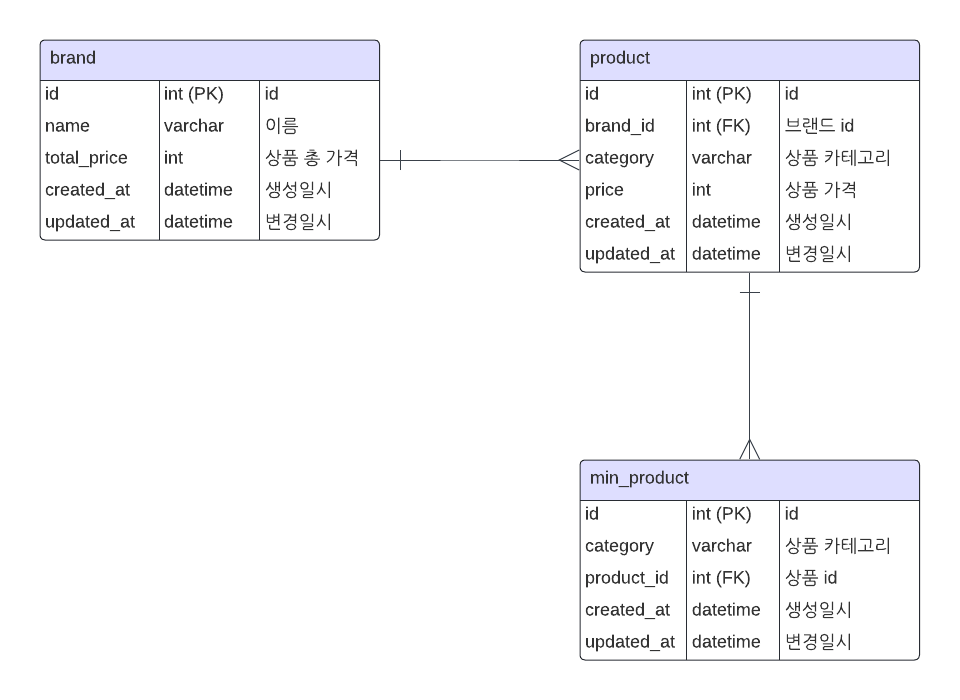

# 코디 완성 서비스

## 기술 스택

- Kotlin 1.9.24
- JDK 21
- Spring Boot 3.3
- H2 Database
- Caffeine Cache
- Spring Rest Docs (AsciiDoc)
- JUnit 5

## 설명

- 준비된 데이터는 `data.csv`에 저장되어있고 `CsvInitializer.kt` 에서 로드해서 DB에 저장한다.

### 구현 1) 카테고리 별 최저가격 브랜드와 상품 가격, 총액을 조회하는 API

- API: GET /v1/search/min-product-by-category
- `min_product` 테이블에 저장된 카테고리 별 최저가 상품을 조회해서 응답한다.
- 상품 생성/수정/삭제 시에 `min_product` 테이블에 최저가 상품을 반영한다.
- 로컬 캐싱을 적용해서 DB 부하를 줄인다.

### 구현 2) 단일 브랜드로 모든 카테고리 상품을 구매할 때 최저가격에 판매하는 브랜드와 카테고리의 상품가격, 총액을 조회하는 API

- API: GET /v1/search/min-brand
- `brand` 테이블에서 브랜드 총 가격(`total_price`)을 DB로 조회한다.
- 상품 생성/수정/삭제 시에 브랜드 총 가격을 업데이트한다.
- 로컬 캐싱을 적용해서 DB 부하를 줄인다.

### 구현 3) 카테고리 이름으로 최저, 최고 가격 브랜드와 상품 가격을 조회하는 API

- API: POST /v1/search/min-max-price
- 최저 가격, 최고 가격인 상품을 각각 `product` 테이블에서 조회한다. 조회 쿼리는 인덱스를 적용한다.
- 코루틴으로 병렬 호출해서 레이턴시를 줄인다.
- 로컬 캐싱을 적용해서 DB 부하를 줄인다.

### 구현 4) 브랜드 및 상품을 추가 / 업데이트 / 삭제하는 API

- 브랜드 API
    - GET /v1/brands/{id} : 브랜드 조회
    - POST /v1/brands : 브랜드 생성
- 상품 API
    - GET /v1/products/{id} : 상품 조회
    - POST /v1/products : 상품 생성
    - PUT /v1/products/{id} : 상품 수정
    - DELETE /v1/products/{id} : 상품 삭제

## ERD



## API 문서

1. 실행 후 `http://localhost:8080/docs/index.html` 로 조회
2. 혹은 `api_doc.pdf` 확인

## 실행 방법

- 빌드: `./gradlew build`
- 테스트: `./gradlew test`
- 실행: `./gradlew bootRun` 후 `http://localhost:8080` 호출

## API cURL

```bash
# 검색 API
curl -X POST 'http://localhost:8080/v1/search/min-max-price' -H "Content-Type: application/json" -d '{"category": "상의"}'

curl -X GET 'http://localhost:8080/v1/search/min-brand' -H "Content-Type: application/json"

curl -X GET 'http://localhost:8080/v1/search/min-product-by-category' -H "Content-Type: application/json"

# 브랜드 API
curl -X POST 'http://localhost:8080/v1/brands' -H "Content-Type: application/json" -d '{"name": "Z"}'

# 상품 API
curl -X GET 'http://localhost:8080/v1/products?brandName=F' -H "Content-Type: application/json"

curl -X GET 'http://localhost:8080/v1/products/48' -H "Content-Type: application/json"

curl -X PUT 'http://localhost:8080/v1/products/48' -H "Content-Type: application/json" -d '{"category":"액세서리","price":1000}'

curl -X POST 'http://localhost:8080/v1/products' -H "Content-Type: application/json" -d '{"brandId": 6, "category":"액세서리","price":500}'

curl -X DELETE 'http://localhost:8080/v1/products/48' -H "Content-Type: application/json"
```

## 추가 아이디어

1. 카테고리가 늘거나 줄어들 수 있으면 enum 대신 DB로 관리한다.
2. 로컬 캐시 대신 리모트 캐시(e.g. Redis)를 적용한다.
3. 1원 미만 단위로 가격을 관리해야하면 BigDecimal로 변경한다. (DB는 DECIMAL)